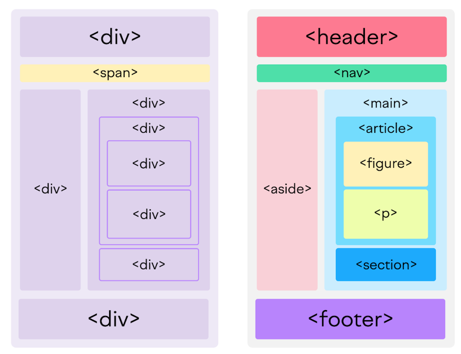

# HTML

- [HTML](#html)
  - [Elementos HTML](#elementos-html)
  - [El árbol HTML](#el-árbol-html)
  - [Elementos para metadatos en `<head>`](#elementos-para-metadatos-en-head)
  - [Agrupar elementos: divs y spans](#agrupar-elementos-divs-y-spans)
  - [Etiquetas semánticas](#etiquetas-semánticas)

## Elementos HTML

Escribir en HTML implica escribir elementos HTML. Un elemento HTML tiene la siguiente sintaxis básica:

```html
<etiqueta>Contenido</etiqueta>
```
Observar que:
- Existen etiquetas
  - Las etiquetas se suelen usar en pares
    - Hay una etiqueta de apertura con el nombre de la etiqueta
    - Hay una etiqueta de cierre con una barra `/` y el nombre de la etiqueta
  - Las etiquetas se envuelven en paréntesis angulares: `<` y `>`, también conocidos como los símbolos de `menor que` y `mayor que`
- Existe un contenido
  - Que suele ser texto normal o también como veremos más adelante puede ser otro elemento HTML
  - Que está envuelto o anidado por las etiquetas

Ejemplos típicos de etiquetas son:
- `<h1>`, `<h2>`, `<h3>` para encabezados de diferentes niveles
- `<p>`: para marcar párrafos
- `<a>`: para marcar enlaces
- ``: para mostrar imágenes. Esta es una etiqueta especial pues no tiene etiqueta de cierre. Es una etiqueta "autocerrada"

```html
<h1>Soy un título de primer nivel</h1>
<p>Soy un párrafo</p>
```

Asimismo los elementos HTML pueden tener atributos, que proveen información y comportamiento adicional a los elementos:

```html
<!-- con un solo atributo -->
<etiqueta clave="valor">Contenido</etiqueta>

<!-- con varios atributos -->
<etiqueta clave="valor" clave="valor" clave="valor">Contenido</etiqueta>

<!-- cuando son muchos atributos se pueden escribir los atributos en varias lineas para mayor claridad -->
<etiqueta 
    clave="valor"
    clave="valor"
    clave="valor">
    Contenido
</etiqueta>

```
Observar que:
- Los atributos están compuestos por pares de claves y valores asociados: `clave="valor"`. Tienen la siguiente sintaxis:
  - Empiezan con el nombre de la clave, seguido por un símbolo de `=`, y finalmente el valor envuelto entre comillas `" "`. Todo sin espacios.
  - Si hay más de un atributo se los separa por un espacio
  - A diferencia de los nombres de las etiquetas HTML, los nombres de los atributos no llevan paréntesis angulares
- Notar que hay un espacio luego del nombre de la etiqueta para escribir el primer atributo.
- Los atributos se ubican dentro de la etiqueta de apertura, no en el contenido ni en la etiqueta de cierre. 

Ejemplos típicos de atributos son:
- Para cualquier elemento
  - `id`: para especificar un nombre único de ese elemento y luego acceder a ese elemento único con CSS o JS
  - `class`: para especificar un nombre de clase (grupo de elementos) y luego acceder a todos ellos con CSS o JS.
    - El atributo `class` puede aceptar varios nombres de clases, en cuyo caso se deben separar por un espacio.
  - Los nombres de ids y clases se deben escribir en minúscula, solo con caracteres en inglés y no deben contener espacios. Si tienen nombres de más de una palabra se debe reemplazar el espacio con guiones (`-`): en vez de `"Boton Primario"`, `"boton-primario"`.
- Para el elemento `<a>`:
  - `href`: para especificar la ruta de la página donde debe dirigir el enlace
- Para el elemento ``
  - `src`: para especificar la ruta de la imagen que se quiere mostrar

```html
<!-- uso de id -->
<p id="parrafo-1">Mi primer párrafo</p>

<!-- uso de clase -->
<ul class="lista"></ul>
<ul class="lista"></ul>
<ul class="lista"></ul>

<!-- uso de multiples clases -->
<h2 class="grande interactivo arco-iris">Titulo 2</h2>

<!-- uso de href -->
<a href="https://www.google.com/">Ir a Google</a>

<!-- uso de src -->


```

## El árbol HTML

El poder de HTML para construir documentos web consiste en la posibilidad de combinar los elementos básicos para crear estructuras más complejas. Para ello debemos formar un "árbol" de elementos HTML, donde los elementos HTML se "anidan" (se colocan unos dentro de otros).

Un árbol es una estructura de organización muy común, que puedes encontrarla, por ejemplo, en tu sistema de archivos. Es una jerarquía de elementos, también llamados en este contexto como "nodos":


Y se puede describir con la siguiente terminología:
- Como un árbol biológico
  - Raíz: el primer nodo de donde descienden todos los demás
  - Rama: las ramificaciones que se desprenden de algún nodo.
  - Nodo interno: los nodos que no son raíz ni hojas
  - Hoja: los nodos sin descendientes
- Como un árbol genealógico
  - Ancestro
  - Descendientes
  - Ascendientes
  - Padre
  - Hijo o hijos
  - Hermano o hermanos

El árbol básico de HTML es el siguiente. Deberas siempre escribir estas etiquetas que marcan la estructura central de todo documento web:

```html
<html>
  <head></head>
  <body></body>
</html>
```
Donde:
- El nodo raiz es el elemento `<html>`
- La raiz tiene dos descendientes:
  - `<head>`: para incluir metadatos
  - `<body>`: aquí pondrás los elementos que quieres que se visualicen en el navegador.

Ya en `<body>` podemos crear un sub-arbol de diversas maneras, por ejemplo si hicieramos un portafolio personal:

```html
<html>
  <head></head>
  <body>
    <h1>Juan Perez</h1>
      <p>Un profesional de la información</p>
    <h2>Experiencia de trabajo<h2>
      <ul>
        <li>Empresa 1</li>
        <li>Empresa 2</li>
        <li>Empresa 3</li>
      </ul>
    <h2>Estudios</h2>
      <ol>
        <li>Escuela</li>
        <li>Colegio</li>
        <li>Universidad</li>
      </ol>
  </body>
</html>
```

> **Tarea**
> - Agregar una imagen suya
> - Agregar enlace a sus redes sociales, pero con imágenes de las redes en vez de solo texto y deben abrir el enlace en una nueva pestaña
> - Agregar una tabla  con la primera columna que diga sus habilidades y la segunda su calificación del 1 al 10
>
> Puedes usar Google para resolver esta tarea, pero no IAs como ChatGPT.

## Elementos para metadatos en `<head>`

En el `<head>` podemos agregar metadatos, que es información sobre el contenido, que no se visualiza directamente en el navegador, pero que sirve para clasificar el contenido y permite una mejor indexación por parte de los motores de búsqueda.

Los más utiles, de momento, son:
- `<title>`: para agregar el título que se verá en la pestaña y los resultados de buscadores
- `<meta name="" content="">`: para agregar metadatos específicos como descripción, autor y palabras clave.

```html
<html>
  <head>
    <title>Portafolio de Juan Perez</title>
    <meta name="description" content="El portafolio de Juan Perez">
    <meta name="author" content="Juan Perez">
    <meta name="keywords" content="Hoja de vida, Portafolio, CV">
  </head>
  <body>
    ...
  </body>
</html>
```

También en el `<head>` se suelen enlazar archivos CSS y JS como veremos más adelante.

## Agrupar elementos: divs y spans

Una actividad muy útil luego de componer un árbol o sub-árbol de HTML es poder agrupar ciertas partes de él, para luego poder tanto estilizar esas partes de un solo golpe o manipularlas con JS. Para ello se utiliza la etiqueta `<div>` (división), que se suele acompañar de los atributos `id`, `class` o `style` (ver CSS).

Por ejemplo, el código que hemos escrito para nuestro portafolio podríamos agruparlo así
```html
<html>
  <head>
    <title>Portafolio de Juan Perez</title>
    <meta name="description" content="El portafolio de Juan Perez">
    <meta name="author" content="Juan Perez">
    <meta name="keywords" content="Hoja de vida, Portafolio, CV">
  </head>
  <body>

    <div class="presentacion-inicial">
      <h1>Juan Perez</h1>
        
        <p>Un profesional de la información</p>
    </div>

    <div class="informacion">
      <h2>Experiencia de trabajo<h2>
        <ul>
          <li>Empresa 1</li>
          <li>Empresa 2</li>
          <li>Empresa 3</li>
        </ul>
      <h2>Estudios</h2>
        <ol>
          <li>Escuela</li>
          <li>Colegio</li>
          <li>Universidad</li>
        </ol>
    </div>

    <div class="contacto">
      <a>Correo electrónico<a>
      <a>LinkedIn<a>
      <a>Twitter<a>
    </div>

  </body>
</html>
```

Observar que:
- Hemos agrupado los elementos del `<body>` en tres partes con sus respectivos divs y clases:
  - `presentacion-inicial`
  - `informacion`
  - `contacto`
- Alrededor de los divs hemos dejado lineas en blanco, simplemente para que se vean mejor los divs. Al interprete de HTML no le importan los espacios o lineas entre los elementos HTML, solo las etiquetas. Pero a nosotros (los humanos), nos sirve como pistas visuales para que el código sea más legible.
- Con esas clases declaradas posteriormente podemos acceder a esas partes con CSS para estilizarlas o con JS para lograr alguna interacción.

Si quisiéramos identificar o agrupar una parte de una linea o contenido, tendríamos que usar la etiqueta `<span>` en lugar de `<div>`:

```html
<div class="presentacion-inicial">
    <h1>Juan Perez</h1>
    
    <p>Un <span id="resaltado">profesional</span> de la información</p>
</div>
```
En este caso, queremos poner algún estilo o interacción especial solo a la palabra 'profesional'.
## Etiquetas semánticas

Hace un tiempo era muy común usar divs para agrupar todo tipo de cosas en HTML. Todavía se usan los divs para ello. Pero ahora para los contenedores típicos que usamos las páginas web, como los _headers_, _footers_ y demás existen etiquetas semánticas, que son más descriptivas de su contenido comparados con los divs y spans:



Los más usados son:
- `<header>`: para contenido introductorio
- `<nav>`: para proporcionar enlaces de navegación, puede ir dentro del header o aparte
- `<main>`: para el contenido principal
- `<section>`: para agrupar secciones, dentro del main o headings
- `<article>`: para contenido independiente, tipo post o comentarios
- `<figure>`: para elementos visuales independientes, suele envolver a los `` dandole más información con `<figcaption>`
- `<footer>`: para la información que va a pie de página

[Aquí](https://developer.mozilla.org/en-US/docs/Web/HTML/Element) puedes una lista completa de todos los elementos HTML, por si necesitas otros para estructurar tu contenido.

[<<Anterior](https://github.com/lab-tecnosocial/curso-programacionweb/tree/main/01-introduccion) | [Siguiente >>](https://github.com/lab-tecnosocial/curso-programacionweb/tree/main/03-css)