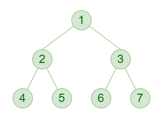

# HTML
## Sintaxis de un elemento HTML

Escribir en HTML implica escribir elementos HTML. Un elemento HTML tiene la siguiente sintaxis básica:

```html
<etiqueta>Contenido</etiqueta>
```
Notar que:
- Existen etiquetas
  - Las etiquetas se usan en pares
    - Hay una etiqueta de apertura con el nombre de la etiqueta
    - Hay una etiqueta de cierre con una barra `\` y el nombre de la etiqueta
  - Las etiquetas se envuelven en parentesis angulares: `<` y `>`, también conocidos como los símbolos de `menor que` y `mayor que`
- Existe un contenido
  - Que suele ser texto normal
  - Que está envuelto o anidado por las etiquetas

Ejemplos típicos de etiquetas son:
- `<h1>`, `<h2>`, `<h3>` para encabezados de diferentes niveles
- `<p>`: para marcar párrafos
- `<a>`: para marcar enlaces
- ``: para mostrar imagenes. Este es una etiqueta especial pues no tiene etiqueta de cierre, a diferencia de los anteriores.

Asimismo los elementos HTML pueden tener atributos, que proveen información adicional a los elementos:

```html
<!-- Con un solo atributo -->
<etiqueta clave="valor">Contenido</etiqueta>

<!-- Con varios atributos -->
<etiqueta clave="valor" clave="valor" clave="valor">Contenido</etiqueta>

<!-- También se puede escribirlo en varias lineas para mayor claridad -->
<etiqueta 
    clave="valor"
    clave="valor"
    clave="valor">
    Contenido
</etiqueta>

```
Notar que:
- Los atributos se ponen dentro de la etiqueta de apertura, no en el contenido ni en la etiqueta de cierre. Notar el espacio luego del nombre de la etiqueta.
- Los atributos tienen su propia sintaxis
  - Empiezan con el nombre de la clave, seguido por un símbolo de `=`, y finalmente el valor envuelto entre comillas `" "`. Todo sin espacio
  - Si hay más de un atributo se los separa por un espacio
  - A diferencia de los nombres de las etiquetas HTML, los nombres de los atributos no llevan parentesis angulares

Ejemplos típicos de atributos son:
- Para cualquier elemento
  - `id`: para especificar un nombre único de ese elemento y luego acceder a él con CSS o JS
  - `class`: para especificar un nombre de clase (grupo) y luego acceder a todos ellos con CSS o JS
- Para el elemento `<a>`:
  - `href`: para especificar la ruta de la página donde debe dirigir el enlace
- Para el elemento ``
  - `src`: para especificar la ruta de la imagen que se quiere mostrar

```html
<!-- uso de id -->
<p id="parrafo-1">Mi primer párrafo</p>

<!-- uso de clase -->
<ul class="listas"></ul>
<ul class="listas"></ul>
<ul class="listas"></ul>

<!-- uso de href -->
<a href="https://www.google.com/">Ir a Google</a>

<!-- uso de src -->


```

## El arbol HTML

La utilidad de HTML reside en poder combinar los elementos básicos para crear estructuras más complejas. Para ello debemos formar un "arbol" de elementos HTML.

Un arbol es una estructura de organización muy común, que puedes encontrarla, por ejemplo, en tu sistema de archivos. Es una jerarquía de elementos, también llamados en este contexto como "nodos":



Y se puede describir con la siguiente terminología:
- De arbol biológico
  - Raiz: el primer nodo de donde descienden todos los demás
  - Rama: las ramificaciones que se desprenden de algún nodo.
  - Hoja: los nodos sin descendientes
- De arbol genealógico
  - Ancestro
  - Descendientes
  - Padre
  - Hijo o hijos

El árbol básico de HTML es el siguiente:

```html
<html>
  <head></head>
  <body></head>
</html>
```
Donde:
- El nodo raiz es el elemento `<html>`
- La raiz tiene dos descendientes:
  - `<head>`: para incluir metadatos
  - `<body>`: para incluir los elementos que visualizarán

Ya en `<body>` podemos expandir el arbol de diversas maneras, por ejemplo:

```html
<html>
  <head></head>
  <body>
    <h1></h1>
    <h2><h2>
      <p></p>
      <ul></ul>
    <h2></h2>
      <ol></ol>
  </head>
</html>
```
