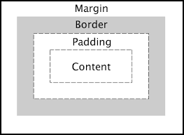
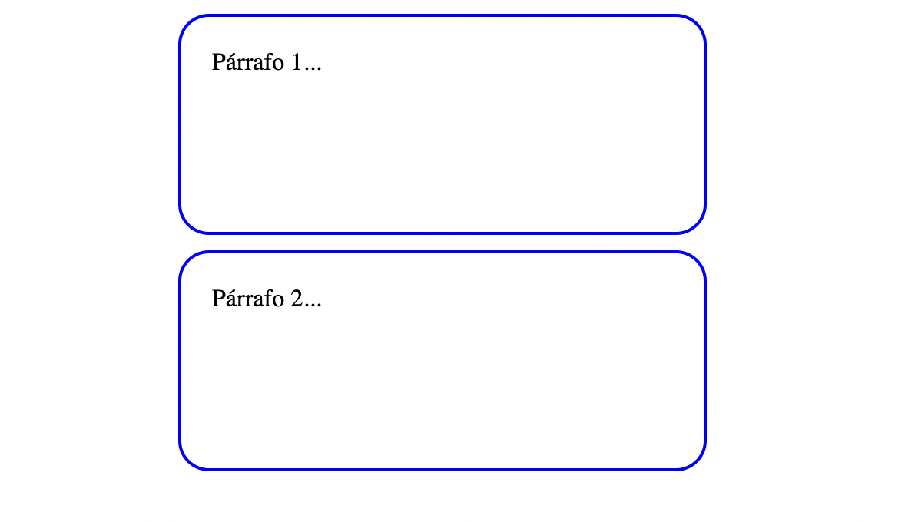
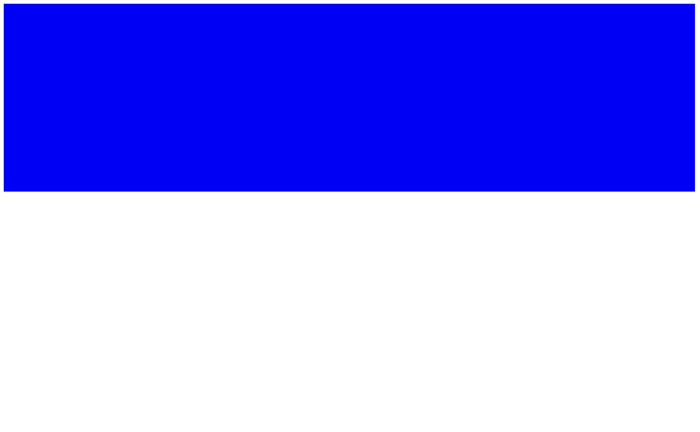
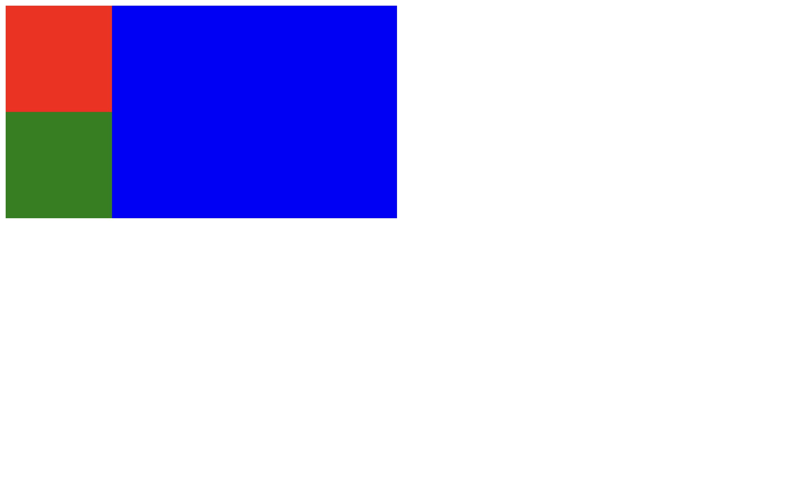
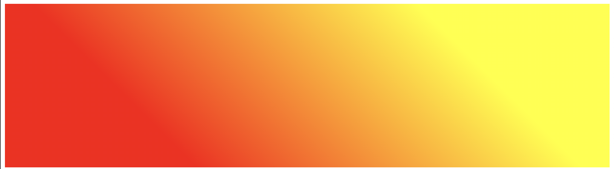
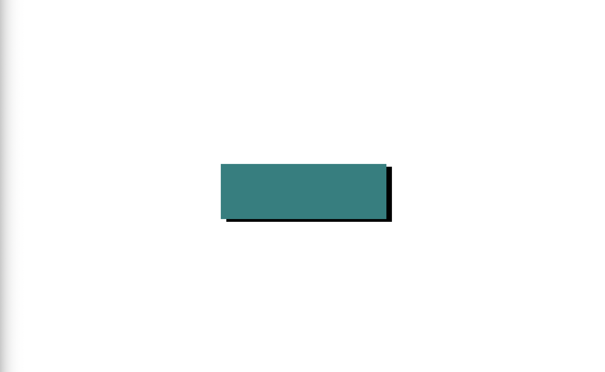

# CSS

## Sintaxis

CSS se escribe de la siguiente forma:

```css
selector {
    propiedad1: valor;
    propiedad2: valor;
    propiedad3: valor;
}
```
Donde:
- Se empieza con un selector, que apunta al elemento al que se quiere cambiar de estilo. Puede ser el nombre de la etiqueta, la clase o el di (ver siguiente sección)
- Se agrega un bloque de declaraciones, que empieza con una llave de apertura `{` y termina con una llave de cierre `}`
- En el bloque se agregan declaraciones de estilo separadas por punto y coma (`;`)
- Cada declaración tiene tres partes:
  - Propiedad: La característica visual que se quiere cambiar
  - Separador: Entre propiedad y valor que son los dos puntos: `:`
  - Valor: El valor específico de la propiedad que se quiera cambiar. Si es más de un valor, entonces se separa con un espacio.

Por ejemplo:
```css
h1 {
  font-size: 16px;
  color: blue;
  background-color: gray;
}
```
## Selectores básicos
Aquí veremos cuatro selectores básicos, luego en otra sección veremos otros selectores más avazandos.

Selector de etiquetas. Para apuntar a modificar etiquetas simplemente debemos anotar el nombre de la respectiva etiqueta. Notar que el nombre de l etiqueta en CSS va sin los parentesis angular:

```css
h1 {

}
p {

}
a {

}
img {

}
```
Selector de clases. Para apuntar a modificar clases enteras. Se debe escribir el nombre de la clase antecedido por un punto (`.`):

```css
.mi-clase {

}
.lista {

}
```
Selector de ids. Para apuntar a modificar un elemento identificado. Se debe escribir el nombre del id antecedido por el simbolo de numeral (`#`):
```css
#titulo-principal {

}
#resaltado {

}
```

Selector universal. Para modificar todos los elementos se usa el símbolo de asterisco (`*`):

```css
* {
  font-size: 14px;
}
```

## 3 formas de usar CSS

Para usar CSS con HTML se puede proceder de tres formas:

- CSS en linea. Aquí no se necesita usar selectores, sino que el CSS va directamente dentro de los elementos HTML usando el atributo `style`. La sintaxis de las declaraciones ya mencionada debe respetarse:

```html
<h1 style="font-size: 10px; text-align: center">Titulo principal</h1>
<p style="color: blue">Este es un párrafo...</p>
```
- CSS interno. Aquí el CSS se pone el CSS separado de los elementos HTML, pero en el mismo archivo, con la etiqueta `<style>` dentro de la etiqueta `<head>`. Aquí se hacen uso de los selectores:
```html
<html>
  <head>
    <style>
      h1 {
        font-size: 10px; 
        text-align: center;
      }
      p {
        color: blue;
      }
    </style>
  </head>
  <body>
    <h1>Titulo principal</h1>
    <p>Este es un párrafo...</p>
  </body>
</html>
```
- CSS externo. Aquí el CSS se escribe un archivo aparte, normalmente `style.css`. Para que funcione es necesario enlazar ese archivo desde el archivo HTML, normalmente `index.html`. Aquí se usa la etiqueta `<link>` para enlazar y luego se escribe CSS puro en el archivo `style.css`:
  
```html
<!-- index.html -->
<html>
  <head>
    <link rel="stylesheet" href="style.css">
  </head>
  <body>
    <h1>Titulo principal</h1>
    <p>Este es un párrafo...</p>
  </body>
</html>
```
```css
/* style.css */
  h1 {
      font-size: 10px; 
      text-align: center;
      }
  p {
      color: blue;
  }
```
## Propiedades básicas de CSS: tipografía y color

Dos conjuntos de propiedades básicas muy utilizados y básicos en el tema del estilo son: la tipografía y el color. Aquí los describiremos.

Para la tipografía (o fuente) se pueden usar las siguientes las siguientes propiedades básicas:
  - `font-family`: Para cambiar el tipo de fuente. Los básicos son: Arial, Verdana, Tahoma, 'Times New Roman', Georgia, Garamond, 'Courier New'. Pero si se quieren añadir otras fuentes se puede usar [Google Fonts](https://fonts.google.com/).
  - `font-size`: Para definir el tamaño de texto. Acepta diversas unidades tanto absolutas como relativas: `px`, `em`, `%`, etc.
  - `font-weight`: Para definir el peso de la fuente. Acepta valores como `normal`, `lighter`, `bold` o algún número.
  - `font-style`: Para cambiarlo a `italic` u `oblique`.
  - `text-align`: Para alinear el texto. Recibe `left|right|center|justify|`

También para la tipografía existen unas propiedades más avanzadas como:
- `text-transform`
- `word-spacing`
- `letter-spacing`
- `line-height`

Sobre el color tenemos las siguientes propiedades:
- Color frontal
  - `color`: afecta al color de frente, normalmente el texto.
- Color de fondo o imagen de fondo
  - `background-color`: Afecta al color de fondo.
  - `background-image`: Opcionalmente se puede poner en vez de un color, una imagen de fondo.
- Opacidad
  - `opacity`: Controla la opacidad del elemento. El valor va entre 0 y 1, pudiendo recibir valores decimales.

Ahora bien, la forma de especificar el color tiene variaciones. Se puede especificar el color en al menos cuatro formas:

- Colores nombrados: que vienen en forma de texto, por ejemplo: red, white, blue, black, etc. Una lista completa de colores nombrados, que son 140, puede verse [aquí](https://www.w3schools.com/cssref/css_colors.php).
- RGB: significa Red, Green, Blue. Es una función que especifica esos tres parametros de colores primarios, que son enteros que van de 0 a 255. Por ejemplo, `rgb(255, 0, 0)1` es el rojo
- Hexadecimal: Similar al anterior, pero especificados con dos digitos hexadecimales por color `#RRGGBB`. Por ejemplo, el rojo es `#FF0000`
- HSL: Una alternativa a RGB, que usa Hue (tono), Saturation (saturación) y Lightness (luminosidad). Donde tono recibe un grado entre 0 y 360 de la rueda del color, y saturación y luminosidad reciben un porcentaje de 0 a 100.

## El módelo de caja (box model)

Todo elemento en HTML está rodeado de una caja, a veces invisible y otras visible. Esto incluye elementos como `<p>`, `<h1>`, ``, `<body>`, etc.

Esta caja tiene cuatro capas:



Si vamos de adentro para afuera, estas cuatro capas son:

- Contenido. Este se especifica con las propieades `width` y `height`
- Borde. Se define con la propiedad `border`
- Relleno. Es el espacio interno a partir del borde. Se define con la propiedad `padding`
- Margen. Es el espacio interno a partir del margen. Se definie con la propiedad `margin`

Por ejemplo, si quisieramos crear párrafos con más estilo:

```html
<html>
  <head>
    <style>
      p {
        width: 100px;
        height: 100px;
        border: solid 2px black;
        padding: 10px;
        margin: 5px auto;
      }
    </style>
  </head>
  <body>
    <p>Párrafo 1...</p>
    <p>Párrafo 2...</p>
  </body>
</html>
```
Queda por resultado:



Asimismo, se puede definir de forma más granular estos parametros especificando que lado del cuadrado queremos modificar (top, right, bottom, left):


Extra: contorno. Es el contorno luego del margen y se especifica con `outline`. Si bien no pertenece propiamente al box model, suele ser útil.

> Tarea: Averigua qué tipos de valores y formas de uso tienen los parametros que vimos:
> - width
> - height
> - border
> - padding
> - margin

## Un truco útil: usar los divs vacíos como capas

Como vimos usamos los divs principalmente para agrupar elementos HTML. Pero también pueden ser usadas de forma independiente como capas que pueden poseer cierta forma, color y demás estilos CSS que le apliques.

Por defecto, un div vacío no parece mostrar nada. Pero si le agregamos una cierta altura (`height`) y color de fondo (`background-color`), podemos visualizarlo:

```html
<html>
  <head>
    <style>
      .capa {
        height: 300px;
        background-color: blue;
      }
    </style>
  </head>
  <body>
    <div class="capa"></div>
  </body>
</html>
```
Resultado:



Observar que:
- El div que usamos no tiene contenido, está vacío.
- El div tiene una clase para poder acceder al elemento desde CSS

Se pueden agrupar varios divs, y acomodarlos como querrramos. Por ejemplo:

```html
<html>
  <head>
    <style>
      .capa1 {
        height: 300px;
        width: 50%;
        background-color: blue;
      }
      .capa2 {
        height: 150px;
        width: 150px;
        background-color: red;
      }
      .capa3 {
        height: 150px;
        width: 150px;
        background-color: green;
      }
    </style>
  </head>
  <body>
    <div class="capa1">
        <div class="capa2"></div>
        <div class="capa3"></div>
    </div>
  </body>
</html>
```


En cuanto a la disposición de los divs, esto siguen el flujo normal (de arriba hacía abajo, alineados a la izquierda). Para poder modificar ese flujo y posicionar los elementos en lugares más interesantes, usaremos las propiedades `display`, `position` y `z-indez` (ver más abajo).

## Degradados (gradientes) y sombras
Dos decoraciones muy útiles y estéticas son los degradados y las sombras.


Los degradados son trancisiones progresivas entre dos o más colores, pueden ser lineales, radiales o cónicas.

Ejemplos básicos de degradados lineales son los siguientes:

```css
/* un degradado que va de rojo a amarillo, por defecto de arriba hacía abajo */
background-image: linear-gradient(red, yellow);

/* se puede cambiar la dirección con un parametro textual */
background-image: linear-gradient(to top right, red, yellow);

/* se puede cambiar la dirección usando grados, donde 0 grados es una linea vertical que va recorrendo hacía la derecha*/
background-image: linear-gradient(45deg, red, yellow);

/* tambien se puede cambiar los puntos donde los colores empiecen a mezclarse, usando porcentajes */
background-image: linear-gradient(45deg, red 25%, yellow 75%);
```
Resultado del último ejemplo:


Es posible poner más de dos colores y también hacer degradados complicados. Para eso recomendamos usar una herramienta visual como [cssgradient.io](https://cssgradient.io/) y luego de diseñar el degradado, copiar el código CSS y usarlo.

La sombra, por su parte, implica un color que se enmarca alrededor de algún elemento HTML, se desplaza, difumina y dispersa, creando el efecto de sombra.

```html
<html>
  <head>
    <style>
      body {
        display: flex;
        justify-content: center;
        align-items: center;
        height: 100vh;
      }
      .caja {
        width: 300px;
        height: 100px;
        background-color: teal;
        box-shadow: 10px 5px black;
      }
    </style>
  </head>
  <body>
    <div class="caja"></div>
  </body>
</html>
```



Observar que:
- El primer valor es el desplazamiento en el eje x (positivo hacía la derecha, negativo hacía la izquierda): 10px
- El segundo valor es el desplazamiento en el eje y (positivo hacía abajo, negativo hacía arriba): 5px;
- El terver valor es un color.

Pero también se le puede agregar una difuminación (blur) y extensión (spread), como tercer y cuarto valor, respectivamente:

```css
box-shadow: 10px 5px 10px 1px black;
```

Si tienes que hacer una sombra más complicada, puedes usar una herramienta visual como [box-shadow.dev](https://box-shadow.dev/).

## Selectores avanzados

Aquí veremos selectores más avazandos de CSS.
  
**Combinando selectores**
- Lista de selectores (OR): coma. Selecciona todas las combinaciones de selectores y les aplica un mismo bloque de declaraciones

```CSS
h1, p, ul {
  color: blue;
}
```
- Combinación de selectores (AND): juntando sin espacio. Aplica el bloque de declaraciones solo a los elementos que contienen todos las etiquetas o clases declaradas:

```CSS
p.titulo {
  color: blue;
}

.titulo.grande {
  font-size: 40px;
}
```
  
- Descencendencia de selectores: espacio. Selecciona todos los descendientes de cierto elemento:

```CSS
h2 p {
  font-size: 10px;
}
```

**Selectores de atributos**

Selecciona los elementos que tienen determinado atributo. Usa corchetes:

```CSS
[target="_blank"] {
  font-weight: bold;
}
```
En este caso se seleccionan todos los elementos `<a>` que se abren en una nueva pestaña.
**Selectores de pseudo-clases**

Permite seleccionar los elementos que tienen cierto estado, como `active`, `focus`, `hover`

```CSS
img:hover {
  opacity: 0.5;
}
```

Con hover se pueden crear animaciones sencillas pero efectivas, sin necesidad de usar JS.


[<<Anterior](https://github.com/lab-tecnosocial/curso-programacionweb/tree/main/02-html) | [Siguiente >>]()
