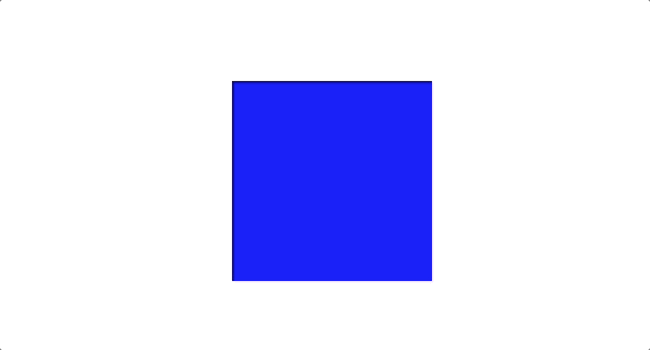
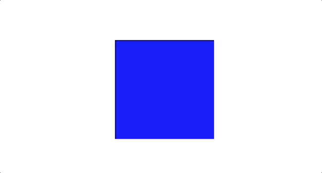
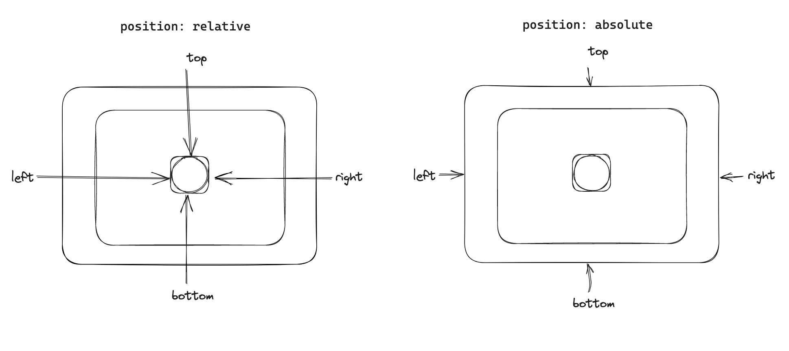
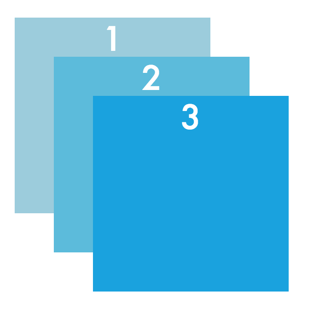
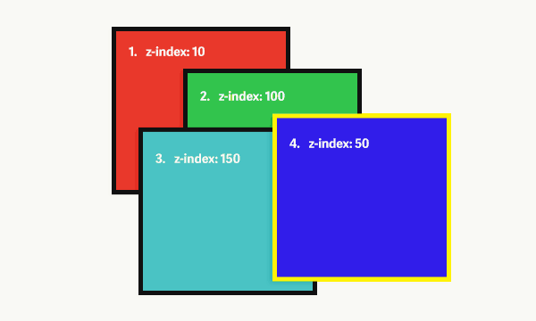
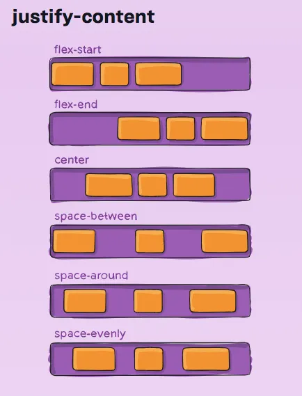
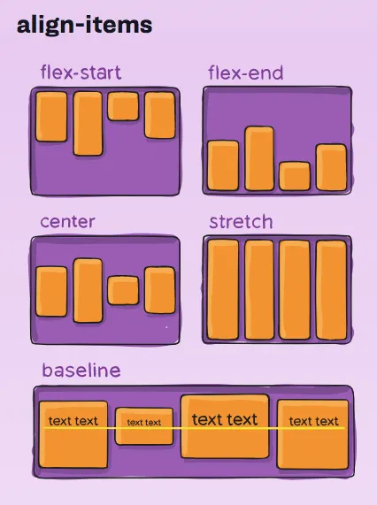
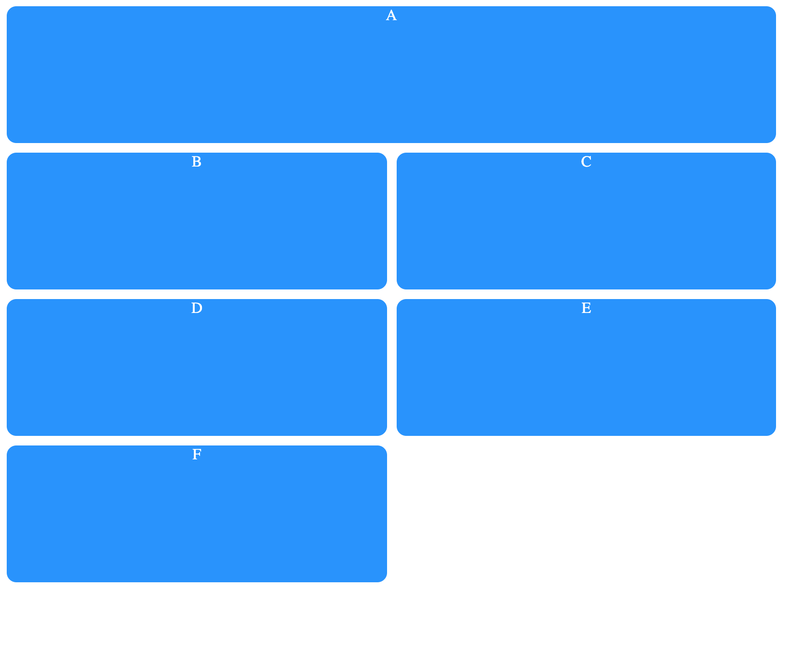

# CSS

- [CSS](#css)
  - [Sintaxis](#sintaxis)
  - [Selectores básicos](#selectores-básicos)
    - [Selector de clases](#selector-de-clases)
    - [Selector de ids](#selector-de-ids)
    - [Selector universal](#selector-universal)
  - [3 formas de usar CSS](#3-formas-de-usar-css)
    - [CSS en linea](#css-en-linea)
    - [CSS interno](#css-interno)
    - [CSS externo](#css-externo)
  - [Propiedades básicas de CSS](#propiedades-básicas-de-css)
    - [Tipografía](#tipografía)
    - [Color](#color)
  - [El módelo de caja (*box model*)](#el-módelo-de-caja-box-model)
  - [Unidades absolutas y relativas](#unidades-absolutas-y-relativas)
  - [Un truco útil: usar los divs vacíos como capas](#un-truco-útil-usar-los-divs-vacíos-como-capas)
  - [Degradados y sombras](#degradados-y-sombras)
    - [Degradados](#degradados)
    - [Sombras](#sombras)
  - [Selectores avanzados](#selectores-avanzados)
    - [Combinando selectores](#combinando-selectores)
    - [Selectores de atributos](#selectores-de-atributos)
    - [Selectores de pseudo-clases](#selectores-de-pseudo-clases)
  - [Animaciones simples con `:hover`, trancisiones y transformaciones](#animaciones-simples-con-hover-trancisiones-y-transformaciones)
  - [Disposición de elementos](#disposición-de-elementos)
    - [El flujo normal, `position`, `display` y `z-index`](#el-flujo-normal-position-display-y-z-index)
    - [Disposiciones de una dimensión con `flex`](#disposiciones-de-una-dimensión-con-flex)
    - [Disposiciones de dos dimensiones con `grid`](#disposiciones-de-dos-dimensiones-con-grid)


## Sintaxis

CSS se escribe de la siguiente forma:

```css
selector {
    propiedad1: valor;
    propiedad2: valor;
    propiedad3: valor;
}
```
Donde:
- Se empieza con un selector, que apunta al elemento al que se quiere cambiar de estilo. Puede ser el nombre de la etiqueta, la clase o el id (ver siguiente sección)
- Se agrega un bloque de declaraciones, que empieza con una llave de apertura `{` y termina con una llave de cierre `}`
- En el bloque se agregan declaraciones de estilo separadas por punto y coma (`;`)
- Cada declaración tiene tres partes:
  - Propiedad: La característica visual que se quiere cambiar
  - Separador: Entre propiedad y valor, que son los dos puntos: `:`
  - Valor: El valor específico de la propiedad que se quiera cambiar. Si es más de un valor, entonces se separa con un espacio. En ocasiones recibe funciones de la forma `funcion(a, b)`, que a su vez recibe argumentos separados por comas.

Por ejemplo:
```css
h1 {
  font-size: 16px;
  color: blue;
  background-color: rgb(250, 0, 0); /* aqui rgb() es una función */
 }
```
## Selectores básicos
Aquí veremos cuatro selectores básicos, luego en otra sección veremos otros selectores más avazandos.

**Selector de etiquetas**

Para apuntar a modificar etiquetas simplemente debemos anotar el nombre de la respectiva etiqueta. Notar que el nombre de la etiqueta en CSS va sin los parentesis angulares:

```css
h1 {
  ...
}
p {
  ...
}
a {
  ...
}
img {
  ...
}
```
### Selector de clases

Para apuntar a modificar clases enteras. Se debe escribir el nombre de la clase antecedido por un punto (`.`):

```css
.mi-clase {

}
.lista {

}
```
### Selector de ids

Para apuntar a modificar un elemento identificado. Se debe escribir el nombre del id antecedido por el simbolo de numeral (`#`):
```css
#titulo-principal {
  ...
}
#resaltado {
  ...
}
```

### Selector universal

Para modificar todos los elementos HTML se usa el símbolo de asterisco (`*`):

```css
* {
  font-size: 14px;
}
```

## 3 formas de usar CSS

Para usar CSS con HTML se puede proceder de tres formas:

### CSS en linea

Aquí no se necesita usar selectores, sino que el CSS va directamente dentro de los elementos HTML usando el atributo `style`. La sintaxis de las declaraciones ya mencionada debe respetarse:

```html
<h1 style="font-size: 10px; text-align: center">Titulo principal</h1>
<p style="color: blue">Este es un párrafo...</p>
```
### CSS interno

Aquí el CSS se pone el CSS separado de los elementos HTML, pero en el mismo archivo, con la etiqueta `<style>` dentro de la etiqueta `<head>`. Aquí se hacen uso de los selectores:
```html
<html>
  <head>
    <style>
      h1 {
        font-size: 10px; 
        text-align: center;
      }
      p {
        color: blue;
      }
    </style>
  </head>
  <body>
    <h1>Titulo principal</h1>
    <p>Este es un párrafo...</p>
  </body>
</html>
```
### CSS externo

Aquí el CSS se escribe un archivo aparte, normalmente `style.css`. Para que funcione es necesario enlazar ese archivo desde el archivo HTML, normalmente `index.html`. Aquí se usa la etiqueta `<link>` para enlazar y luego se escribe CSS puro en el archivo `style.css`:
  
```html
<!-- index.html -->
<html>
  <head>
    <link rel="stylesheet" href="style.css">
  </head>
  <body>
    <h1>Titulo principal</h1>
    <p>Este es un párrafo...</p>
  </body>
</html>
```
```css
/* style.css */
  h1 {
      font-size: 10px; 
      text-align: center;
      }
  p {
      color: blue;
  }
```
## Propiedades básicas de CSS

Dos conjuntos de propiedades básicas muy utilizados y básicos en el tema del estilo son: la tipografía y el color.

### Tipografía

Para la tipografía (o fuente) se pueden usar las siguientes las siguientes propiedades básicas:
  - `font-family`: Para cambiar el tipo de fuente. Los básicos son: Arial, Verdana, Tahoma, 'Times New Roman', Georgia, Garamond, 'Courier New'. Pero si se quieren añadir otras fuentes se puede usar [Google Fonts](https://fonts.google.com/).
  - `font-size`: Para definir el tamaño de texto. Acepta diversas unidades tanto absolutas (`px`, `mm`), como relativas (`em`, `rem`, `%`), etc.
  - `font-weight`: Para definir el peso de la fuente. Acepta valores como `normal`, `lighter`, `bold` o algún número.
  - `font-style`: Para cambiarlo a `italic`
  - `text-align`: Para alinear el texto. Recibe `left|right|center|justify|`

También para la tipografía existen unas propiedades más avanzadas como:
- `text-transform`: para volver el testo en todo mayúsculas o minusculas
- `text-decoration`: para poner una linea arriba, debajo o en medio del texto
- `text-indent`: para definir la sangría
- `word-spacing`: el espacio entre palabras
- `letter-spacing`: el espacio entre letras
- `line-height`: define la altura de las lineas de texto

### Color

Sobre el color tenemos las siguientes propiedades:
- Color frontal
  - `color`: afecta al color de frente, normalmente el texto.
- Color de fondo o imagen de fondo
  - `background-color`: Afecta al color de fondo.
  - `background-image`: Opcionalmente se puede poner en vez de un color, una imagen de fondo o especificar un degradado en esta propiedad.
- Opacidad
  - `opacity`: Controla la opacidad del elemento. El valor va entre 0 y 1, pudiendo recibir valores decimales.

Ahora bien, la forma de especificar el color tiene variaciones. Se puede especificar el color en al menos cuatro formas:

- **Colores nombrados:** que vienen en forma de texto, por ejemplo: red, white, blue, black, etc. Una lista completa de colores nombrados, que son 140, puede verse [aquí](https://www.w3schools.com/cssref/css_colors.php).
- **RGB:** significa Red, Green, Blue. Es una función que especifica esos tres parametros de colores primarios, que son enteros que van de 0 a 255. Por ejemplo, `rgb(255, 0, 0)` es el rojo
- **Hexadecimal:** Similar al anterior, pero especificados con dos digitos hexadecimales por color `#RRGGBB`. Por ejemplo, el rojo es `#FF0000`
- **HSL:** Una alternativa a RGB, que usa Hue (tono), Saturation (saturación) y Lightness (luminosidad). Donde tono recibe un grado entre 0 y 360 de la rueda del color, y saturación y luminosidad reciben un porcentaje de 0 a 100.

Las funciones `rgb()` y `hsl` tienen una variación que incluye la opacidad (tambien llamada como 'canal alfa'): `rgba()` y `hsla()`.

## El módelo de caja (*box model*)

Todo elemento en HTML está rodeado de una caja, a veces invisible y otras visible. Esto incluye elementos como `<p>`, `<h1>`, ``, `<body>`, etc.

Esta caja tiene cuatro capas:


Si vamos de adentro para afuera, estas cuatro capas son:

- **Contenido**. Este se especifica con las propiedades `width` y `height`
- **Borde**. Se define con la propiedad `border`
- **Relleno**. Es el espacio interno a partir del borde. Se define con la propiedad `padding`
- **Margen**. Es el espacio interno a partir del margen. Se definie con la propiedad `margin`

Extra: contorno. Es el contorno luego del margen y se especifica con `outline`. Si bien no pertenece propiamente al box model, suele ser útil en estos casos.

Por ejemplo, si quisieramos crear párrafos con más estilo:

```html
<html>
  <head>
    <style>
      p {
        width: 100px;
        height: 100px;
        border: solid 2px black;
        padding: 10px;
        margin: 5px auto;
      }
    </style>
  </head>
  <body>
    <p>Párrafo 1...</p>
    <p>Párrafo 2...</p>
  </body>
</html>
```
Que da por resultado:


Observar que estas propiedades, dependiendo de la cantidad de valores que reciban, se portarán de una u otra forma. Por ejemplo, `padding` y `margin` si reciben:
- 4 valores: los aplica a todo los lados del cuadrado empezando de arriba y en sentido horario: arriba, derecha, abajo, izquierda.
- 2 valores: aplica el primer valor tanto arriba como abajo (eje vertical) y el segundo valor tanto a la derecha como izquierda (eje horizontal)
- 1 valor lo aplican a todos los cuatro lados del cuadrado

Asimismo, se puede definir de forma más granular estos parametros especificando que lado del cuadrado queremos modificar (top, right, bottom, left):


> Tarea: Averigua qué tipos de valores y formas de uso tienen los parametros que vimos:
> - width
> - height
> - border
> - padding
> - margin

## Unidades absolutas y relativas

Para especificar tamaños en el modelo de caja y otros, hasta ahora hemos utilizado solo pixeles (`px`), pero ahora veremos que es posible usar otras unidades de medida, diferenciando entre unidades absolutes y relativas:
- Unidades absolutas: Especifican un tamaño fijo de los elementos. El problema es que los dispositivos tienen diferentes resoluciones (cantidad de pixeles), que hace que estas unidades no se adapten del todo bien a diferentes resoluciones (celular, tablet, computadora, smart tv, etc.)
  - `px`: se usa para pantallas, ej. `10px`
  - `cm` y `mm`: se usan más para impresiones
- Unidades relativas: Especifican un tamaño en relación a otro elemento, lo que hace que se adapten mejor a diferentes tamaños de pantallas.
  - `em` y `rem`: relativo al tamaño del elemento ya definido (ej. `0.5`, `2`) en el caso del `em` y al tamaño de elemento de la raiz en el caso de `rem`
  - `ch`: relativo al ancho del 0 de la tipografía utilizada
  - `%`: relativo al tamaño del elemento padre
  - `vh` y `vw`: *viewport height* y *viewport width* calculan el porcentaje total del alto y ancho de la pantalla, respectivamente (ej. `10vh`, `50vw`)

Un truco útil es usar `100vh` en el alto (`height`) del `body` o de otro elemento para hacer que ocupe el 100% de la altura de la pantalla.

## Un truco útil: usar los divs vacíos como capas

Como vimos usamos los divs principalmente para agrupar elementos HTML. Pero también pueden ser usadas de forma independiente como capas que pueden poseer cierta forma, color y demás estilos CSS que le apliques.

Por defecto, un div vacío no parece mostrar nada. Pero si le agregamos una cierta altura (`height`) y color de fondo (`background-color`), podemos visualizarlo:

```html
<html>
  <head>
    <style>
      .capa {
        height: 300px;
        background-color: blue;
      }
    </style>
  </head>
  <body>
    <div class="capa"></div>
  </body>
</html>
```
Resultado:


Observar que:
- El div que usamos no tiene contenido, está vacío.
- El div tiene una clase para poder acceder al elemento desde CSS

Se pueden agrupar varios divs, y acomodarlos como querrramos. Por ejemplo:

```html
<html>
  <head>
    <style>
      .capa1 {
        height: 300px;
        width: 50%;
        background-color: blue;
      }
      .capa2 {
        height: 150px;
        width: 150px;
        background-color: red;
      }
      .capa3 {
        height: 150px;
        width: 150px;
        background-color: green;
      }
    </style>
  </head>
  <body>
    <div class="capa1">
        <div class="capa2"></div>
        <div class="capa3"></div>
    </div>
  </body>
</html>
```


En cuanto a la disposición de los divs, esto siguen el flujo normal (de arriba hacía abajo, alineados a la izquierda). Para poder modificar ese flujo y posicionar los elementos en lugares más interesantes, usaremos las propiedades `display`, `position` y `z-indez` (ver más abajo).

## Degradados y sombras

### Degradados

Los degradados son trancisiones progresivas entre dos o más colores. Pueden ser lineales, radiales o cónicas.

Ejemplos básicos de degradados lineales son los siguientes:

```css
/* un degradado que va de rojo a amarillo, por defecto de arriba hacía abajo */
background-image: linear-gradient(red, yellow);

/* se puede cambiar la dirección con un parametro textual */
background-image: linear-gradient(to top right, red, yellow);

/* se puede cambiar la dirección usando grados, donde 0 grados es una linea vertical que va recorrendo hacía la derecha*/
background-image: linear-gradient(45deg, red, yellow);

/* tambien se puede cambiar los puntos donde los colores empiecen a mezclarse, usando porcentajes */
background-image: linear-gradient(45deg, red 25%, yellow 75%);
```
Resultado del último ejemplo:


Es posible poner más de dos colores y también hacer degradados complicados. Para eso recomendamos usar una herramienta visual como [cssgradient.io](https://cssgradient.io/) y luego de diseñar el degradado, copiar el código CSS y usarlo.

### Sombras

Implican un color que se enmarca alrededor de algún elemento HTML, se desplaza, difumina y dispersa, creando el efecto de sombra.

```html
<html>
  <head>
    <style>
      body {
        display: flex;
        justify-content: center;
        align-items: center;
        height: 100vh;
      }
      .caja {
        width: 300px;
        height: 100px;
        background-color: teal;
        box-shadow: 10px 5px black;
      }
    </style>
  </head>
  <body>
    <div class="caja"></div>
  </body>
</html>
```


Observar que:
- El primer valor es el desplazamiento en el eje x (positivo hacía la derecha, negativo hacía la izquierda): 10px
- El segundo valor es el desplazamiento en el eje y (positivo hacía abajo, negativo hacía arriba): 5px;
- El terver valor es un color.

Pero también se le puede agregar una difuminación (blur) y extensión (spread), como tercer y cuarto valor, respectivamente:

```css
box-shadow: 10px 5px 10px 1px black;
```

Si tienes que hacer una sombra más complicada, puedes usar una herramienta visual como [box-shadow.dev](https://box-shadow.dev/).

## Selectores avanzados

Aquí veremos selectores más avazandos de CSS.
  
### Combinando selectores
- Lista de selectores (OR): coma. Selecciona todas las combinaciones de selectores y les aplica un mismo bloque de declaraciones

```CSS
h1, p, ul {
  color: blue;
}
```
- Combinación de selectores (AND): juntando sin espacio. Aplica el bloque de declaraciones solo a los elementos que contienen todos las etiquetas o clases declaradas:

```CSS
p.titulo {
  color: blue;
}

.titulo.grande {
  font-size: 40px;
}
```
  
- Descencendencia de selectores: espacio. Selecciona todos los descendientes de cierto elemento:

```CSS
h2 p {
  font-size: 10px;
}
```

### Selectores de atributos

Selecciona los elementos que tienen determinado atributo. Usa corchetes:

```CSS
[target="_blank"] {
  font-weight: bold;
}
```
En este caso se seleccionan todos los elementos `<a>` que se abren en una nueva pestaña.
### Selectores de pseudo-clases

Permite seleccionar los elementos que tienen cierto estado, como `active`, `focus`, `hover`

```CSS
img:hover {
  opacity: 0.5;
}
```

Una forma divertida de practicar con los selectores CSS es jugando el juego [CSS Diner](https://flukeout.github.io/).

## Animaciones simples con `:hover`, trancisiones y transformaciones

Con la pseudo-clase `:hover` es posible hacer animaciones simples pero efectivas en CSS, sin necesidad de usar JS. Para ello, adicionalmente necesitaremos la propiedad `transition` para hacer los cambios más suaves interpolando los valores intermedios de los cambios. También necesitaremos aprender más de la propiedad `transform` que nos permite hacer transformaciones geométricas básicas como escalar, mover, rotar o sesgar un elemento.

Empezaremos con un ejemplo básico. Queremos que un cuadrado se vuelva en un circulo al hacer pasar el puntero del mouse por él:

```css
.cuadrado {
  height: 200px;
  width: 200px;
  background-color: blue;
}

.cuadrado:hover {
  border-radius: 50%;
}
```


Este código funciona, pero la trancisión entre el cuadrado y el circulo es muy repentina. Para que parezca una animación fluida, necesitamos interpolar los valores intermedios entre los dos estados: de cuadrado a círculo. La propiedad `transition` nos permito eso. Puede recibir de 1 a 4 valores, dependiendo de qué comportamiento querramos lograr:

- Solo especificando la duración: `transition: 1s`, donde la trancisión se aplica a todas las propiedades y recibe una duración que puede recibir segundos (`s`) o milisegundos (`ms`)
- Especificando la propiedad, duración, función de aceleración y retraso: `transition: width 2s ease 1s`

```css
.cuadrado {
  height: 200px;
  width: 200px;
  background-color: blue;
  transition: 500ms;
}

.cuadrado:hover {
  border-radius: 50%;
}
```


Observar que la propiedad de trancisión se pone en el elemento inicial y no en el hover.

Ahora bien, para poder hacer animaciones simples más interesantes, podemos hacer uso de la propiedad `transform`, que puede recibir las siguientes funciones:
- `scale()`: para modificar la escala o tamaño por algun factor (ej. 0.5, 2.0, etc.). Si recibe un valor modifica al elemento proporcionalmente. Si recibe dos valores modifica con el primero el eje X y con el segundo el eje Y.
- `translateX()`, `translateY()`: para mover el elemento en el eje X o Y. Si se quiere mover en diagonal se puede usar `translate(x, y)` con dos valores. En CSS, en el eje X para ir hacía la derecha se usan valores positivos y negativos para ir a la izquierda; en el eje Y, para ir hacía abajo se usan valores positivos y negativos para ir arriba. La coordenada (0, 0) es el punto de origen donde está el elemento.
- `rotate()`: para rotar según un ángulo (ej. `45deg`)
- `skew()`: para sesgar con algún ángulo

Por ejemplo:
```css
.cuadrado:hover {
  transform: scale(0.5) rotate(45deg)
}
```


## Disposición de elementos

### El flujo normal, `position`, `display` y `z-index`

Para poder hacer disposiciones (layouts) de elementos más interesantes, primero debemos entender cuál es el posicionamiento (`position`) y visualización (`display`) que por defecto hace CSS, para luego modificarlo. A esta visualización se llama el "flujo normal", que consiste en:
- Todos los elementos llevan por defecto la posición `position: static`
- Donde los elementos bloque (que llevan `display: block`), como es el caso de `<h1>`, `<p>`, `<div>`, `<section>`, se distribuyen de arriba hacía abajo, ocupando el 100% del ancho, a menos que se especifique un ancho, en cuyo caso se reduce el mismo y se alinea a la izquierda.
- Y los elementos 'en linea' (que llevan `display: inline`), como es el caso de `<a>`, `<span>`, ``, `<button>`, se distribuyen de izquierda a derecha, ocupando solo el espacio que necesitan. Si queremos que estos elementos se comporten como bloques debemos cambiar su propiedad de `display: inline` a `display: block`. 


Una vez entendido lo anterior, entonces podemos modificar el posicionamiento y la visualización de los elementos cambiando esas propiedades:
- Modificando `display`
  - Podemos hacer que el elemento desaparezca con: `display: none`
  - Podemos alinear automáticamente los elementos en una dimensión (horizontal o vertical) desde un elemento contenedor con: `display: flex`. O alinearlos automáticamente en una cuadricula de dos dimensiones con `display: grid` (ver más abajo)
- Modificando `position`:
  - Podemos modificar la posición del elemento relativo a donde se encuentra con `position: relative`
  - Podemos modificar la posición del elemento en relación al primer elemento padre que no sea `static` con `position: absolute`
  - Luego usando las propiedades `top`, `bottom`, `left` o `right` especificamos hacía donde queremos moverlo usando unidades absolutas o relativas

Para diferenciar bien entre las posiciones `absolute` y `relative`, puedes guiarte con el siguiente diagrama:



Observa que la referencia de qué es `top`, `bottom`, `left` y `right` varía. Y ser verían de la siguiente forma:

```css
.cuadrado {
  background-color: blue;
  position: relative;
  top: 50px;  /* empujarlo 50px desde arriba */
}
```

```css
.cuadrado {
  background-color: blue;
  position: absolute;
  top: 50px;
  left: 50px;
}
```
Dado que un elemento cualquier puede tener muchos padres, si uno quisiera cambiar la referencia de a qué elemento especificamente nos referimos, entonces simplemente es cosa de asegurarnos de que ese padre tenga un `position` diferente de `static`. Normalmente lo volveremos `relative`:

```css
.abuelo{
  ...
}

.padre{
  position: relative;
}

.hijo{
  position: absolute:
  top: 50%:
  left: 50%;
}
```
De esta forma esquivaremos al elemento 'abuelo' y el 'hijo' se movera a partir del 'padre'.

Con ese mismo patrón, usando la combinación de `absolute` con `relative`, es posible superponer varios elementos HTML. Por ejemplo:



También para la propiedad `position` existen los valores `fixed` para ubicarlo en lugar fijo de la pantalla sin importar el scroll y `sticky` que permite cierto scroll y luego podmemos 'pegarlo' en algun lugar de la pantalla.

Una vez que apilemos varias capas de elementos HTML, en algún momento podemos querer cambiar su orden (cuán atrás o adelante está el elemento), tal como se hace en las capas de Photoshop o Illustrator. Para ello podemos usar la propiedad `z-index` que puede ser entendido como la profundidad del elemento, entre un número más bajo más bajo, y entre un número más alto más arriba:


### Disposiciones de una dimensión con `flex`

Con flex podemos alinear facilmente elementos que están en una "fila" o una "columna". En vez de hacer el posicionamiento manualmente con la propiedad `position` y `top`, `bottom`, `right` y `left`, podemos aprovechar `flex` para que la alineación se realice de forma más automática, y que incluso se ajustará por sí mismo si el tamaño de la pantalla cambia (diseño 'responsivo').

Para ello debemos diferenciar entre:
- El contenedor flex: normalmente un `<div>` u otro elemento padre
- Los elementos flex: todos los elementos que están dentro del contenedor

Las propiedades que veremos para que funcionen, a veces se especifican en el contenedor y otras en los elementos:

```css
.contenedor{
  display: flex;
  justify-content: center;
  align-items: center;
}
.elementos {
  ...
}
```
Observar que:
- La declaración `display: flex` va el contenedor. Una vez se declara esta regla, los elementos pasan del flujo normal de bloque a estar de forma horizontal.
- Así tambien van en el contenedor `justify-content` que indica cómo se debe alinear en el eje horizontal y `align-items` que indica como se debe alinear en el eje vertical.
- Con ese código se puede lograr centrar un elemento tanto horizontal como verticalmente.

`justify-content` puede recibir además los siguientes valores y dar los siguientes resultados:



Mientras que `align-items`:



Otra propiedades útiles de flex son:
- Para el contenedor flex
  - `flex-direction`: para especificar la dirección que puede ser `row|row-reverse|column|column-reverse`
  - `flex-wrap`: para controlar si los elementos se quedan en la misma linea o pasan a otras: `wrap|wrap-reverse|no-wrap|`. Por defecto está en `no-wrap`.
- Para los elementos flex
  - `flex`: que permite especificar cuánto está permitido que crezca, se reduzca y su base. Por ejemplo: `flex: 2 1 100px`
### Disposiciones de dos dimensiones con `grid`

Con `grid`, a diferencia de `flex`, podemos controlar no solamente filas y columnas, sino grillas o cuadriculas enteras, que puede servir tanto para elementos especificos que requieran una cuadricula o para estructurar todo el sitio web entero.

Al igual que con flex, hay algunas propiedades que se deben especificar en el contenedor y otras en los elementos. Los básicos son:

- Contenedor grid:
  - `display: grid`: para especificar que queremos una cuadricula
  - `grid-template-column` o `grid-template-row`: para especificar el número y tamaño de las filas o columnas que queremos. Podemos usar unidades absolutas como los pixeles o una nueva unidad relativa fraccionaria (`fr`) si queremos ocupar todo el espacio disponible. Ej. `grid-template-column: 200px 200px` para una cuadricula de 2 columnas de 200px o  `grid-template-column: 1fr 1fr`
  - `gap`: para dar espacio entre las filas y columnas. Ej. `gap: 5px 10px`.
- Elementos grid:
  - `grid-column`: para aumentar el numero de cuadros hacía las columnas que queremos que ocupe el elemento. Ej. `grid-column: 1 / 3` (el ultimo número debe ser uno demás)
  - `grid-row`: para aumentar el numero de cuadros hacía las filas que queremos que ocupe el elemento. Ej. `grid-row: 1 / 3`
  - `grid-area`: para especificar tanto el aumento en fila y columna al mismo tiempo. Ej. `grid-area: 2 / 3 / 4 / span 5`


```html
<html>

  <head>
    <style>
     .grilla {
      width: 400px;
      height: 500px;
      display: grid;
      grid-template-columns: 100px 100px;
      gap: 10px 10px;
    }

    .caja {
      background-color: dodgerblue;
      text-align: center;
      color: white;
      border-radius: 10px;
    }
      
    .a {
        grid-column: 1 / 3;
    }
    </style>
  </head>

  <body>
    <div class="grilla">
      <div class="caja a">A</div>
      <div class="caja b">B</div>
      <div class="caja c">C</div>
      <div class="caja d">D</div>
      <div class="caja e">E</div>
      <div class="caja f">F</div>
    </div>
  </body>

</html>
```

Que da por resultado:



[<<Anterior](https://github.com/lab-tecnosocial/curso-programacionweb/tree/main/02-html) | [Siguiente >>]()
