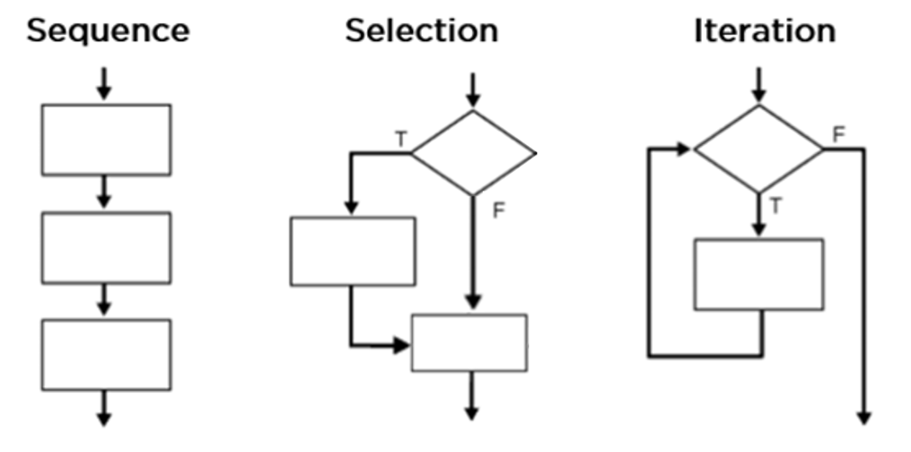
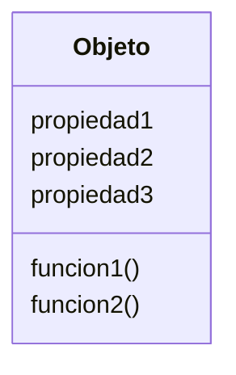
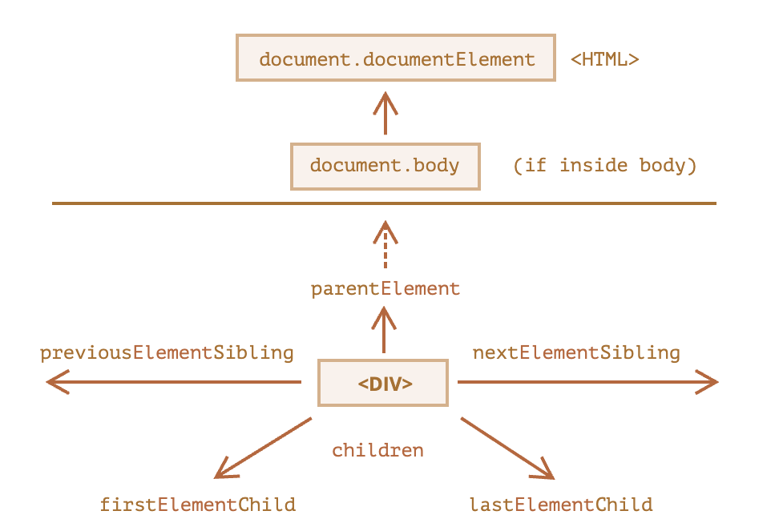
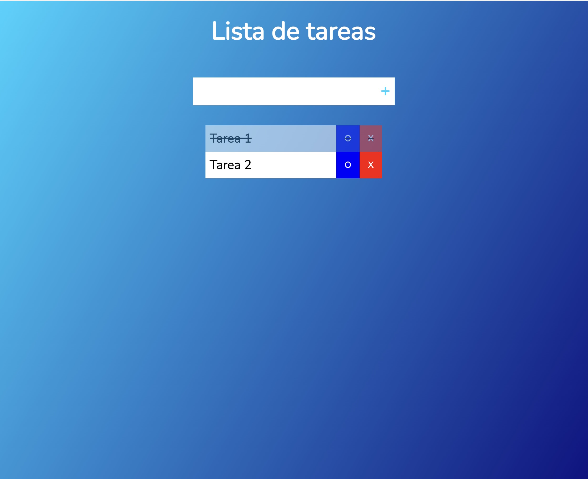

# JS

- [JS](#js)
  - [Fundamentos de programación en JS](#fundamentos-de-programación-en-js)
    - [Variables y tipos de datos](#variables-y-tipos-de-datos)
    - [Operadores y evaluación](#operadores-y-evaluación)
    - [Colecciones](#colecciones)
      - [Arreglos (arrays)](#arreglos-arrays)
      - [Objetos](#objetos)
      - [JSON](#json)
    - [Funciones](#funciones)
    - [Estructuras de control](#estructuras-de-control)
      - [Condicionales](#condicionales)
      - [Bucles (loops)](#bucles-loops)
    - [Objetos y clases](#objetos-y-clases)
  - [Programación web con JS](#programación-web-con-js)
    - [El DOM](#el-dom)
      - [Búsqueda en el DOM](#búsqueda-en-el-dom)
      - [Recorrido en el DOM](#recorrido-en-el-dom)
    - [Trabajar con elementos y atributos](#trabajar-con-elementos-y-atributos)
    - [Modificación de estilos](#modificación-de-estilos)
    - [Eventos](#eventos)
  - [Una app web completa](#una-app-web-completa)

JavaScript es un lenguaje de programación que nos permite añadir interactividad a nuestro contenido.

Aprender JavaScript para programación web tiene típicamente dos partes:

- Aprender los fundamentos del lenguaje de programación por sí mismos
  - Variables y tipos de datos
  - Colecciones
  - Funciones
  - Estructuras de control
  - Clases y objetos
- Aprender cómo JavaScript puede interactuar con HTML y CSS en un proyecto web:
  - Manipulación del DOM
  - Manipulación de estilos
  - Interacción y eventos

## Fundamentos de programación en JS

### Variables y tipos de datos

Una variable es como un contenedor etiquetado que contiene o hace referencia a un determinado valor que puede variar. Por ejemplo:
```js
let persona = "Juan Perez";
const PI = 3.1416;
```
Notar que:
- Para declarar una variable la primera vez es necesario usar la palabra clave `let` si la asignación cambiará en el futuro, sino cambia puedes usar `const`
- Luego hay que poner el nombre o identificador de la variable, en este caso `persona`. Hay unas reglas para especificar los nombres de las variables:
  - Deben contener solo caracteres en inglés, no ñ, ni tildes
  - Deben ser una sola palabra, y si tienen más de una palabra se debe usar el "camel case", es decir en vez de `nombre completo`: `nombreCompleto`.
  - Los nombres de las variables deben describir el contenido. Evitar nombres de variables como `a`, `b`, etc.
- Luego antes de darle el valor específico es necesario usar el operador de asignación que en JavaScrip es `=`. Este operador es diferente al operador de igualdad `===`. Simplemente quiere decir que se asigne el valor de la derecha al nombre de la izquierda
- Finalmente el valor o dato en sí. En este caso es un texto o _string_: `"Juan Perez"`. En el valor de tipo texto se puede usar cualquier carácter UTF8, se puede escribir ortográficamente en español usando tanto tildes, eñes y hasta emojis 🙂.

Los valores que puedes "guardar" en las variables tienen __tipos__, que dictan qué tipo de valor son y qué operaciones pueden realizarse con ellas. Los tipos más comunes son:

- `string` (cadena de caracteres): Texto. Se deben escribir envuelto en comillas dobles `" "` o simples `' '`.
- `number` (número): Tanto entero (`1`, `2`, `3`), como decimal (`4.5`, `10.456`). Se escriben tal cual.
- `boolean` (booleano): Un tipo de dato que puede aceptar solamente dos valores: `true` y `false`. Muy útil para expresiones lógicas, condicionales y bucles.
- `undefined` (no definido): Significa que no tiene un valor asignado, pero no se asigna explícitamente.
- `null` (nulo): Significa que no tiene valor asignado, pero se asigna explícitamente.

Podemos usar el operador `typeof` para chequear de qué tipo es una variable o valor. 

Las variables tienen un **ciclo de vida**. Nacen, las usamos, las actualizamos y son eliminadas. De forma didáctica podríamos usar el acrónimo CRUD que viene de las bases de datos para entender un poco mejor este comportamiento de las variables:

- **C**reate (crear): las variables se declaran o definen la primera vez que se nombran. Por ejemplo, `let miNumeroFavorito = 13;`
- **R**ead (leer): para usar la variable ya no es necesario usar la palabra clave `let`. Es suficiente usar su nombre, por ejemplo `miNumeroFavorito + 3` da como resultado 16.
- **U**pdate (actualizar): si queremos cambiar el valor de la variable podemos reasignarle un valor, otra vez solo llamándolo y usando nuevamente el operador de asignación: `miNumeroFavorito = 33`
- **D**elete (borrar): JavaScript se encarga de borrar de la memoria automáticamente las variables que ya no se necesitan.

Las variables son muy útiles en programación porque pueden guardar datos y sus transformaciones. Se podría definir a un programa como un conjunto de instrucciones que operan sobre datos:

 $$\text{programa = instrucciones(datos)}$$

### Operadores y evaluación

Vimos que las las variables guardan datos, pero ¿y las instrucciones? Las instrucciones pueden venir en forma:

- Operadores: que son símbolos que ejecutan alguna operación sobre operandos, que suelen ser variables
  - Operadores de asignación
    - `=`: para asignar el valor de la derecha a la variable de la izquierda
    - `+=`: para aumentar un valor a la misma variable
    - `-=`: para restar un valor a la misma variable
  - Operadores aritméticos, que pueden hacer funcionar a JavaScript como una calculadora:
    - `+`: suma cuando hay números (o concatenación cuando son strings)
    - `-`: resta
    - `*`: multiplicación
    - `/`: división
    - `**`: exponenciación
    - `++`: incremento (operador unario)
    - `--`: decremento (operador unario)
  - Operadores de comparación:
    - `===`: igual que
    - `!==`: no igual que
    - `>`: mayor que
    - `<`: menor que
    - `>=`: mayor o igual que
    - `<=`: menor o igual que
  - Operadores lógicos:
    - `&&`: $y$ o conjunción
    - `||`: $o$ o disyunción
    - `!`: $\text{no}$ o negación
- Funciones: que son procedimientos que se aplican a unas entradas y producen unas salidas. Por ejemplo:
  - `console.log()` para imprimir resultados en consola
  - `alert()`: despliega una caja de alerta en la ventana del navegador
  - `Math.random()` para generar números aleatorios
- Composiciones de funciones: que aplican varias funciones a determinados datos

Por ejemplo, podemos hacer sumas sobre variables numéricas y mostrar el resultado en consola:

```js
let ganancias = 400;
let bonos = 40;

console.log(ganancias + bonos) // se evalúa a 440


```
Lo anterior funciona porque las variables se evalúan a sus valores originales, luego se suman y se ejecutan las funciones. Lo cual sucede con cualquier expresión. Una expresión es una combinación compleja entre variables, operadores y funciones que se evalúan en un resultado.

Otro ejemplo con tipos de datos diferentes:

```js
let nombre = 'Juan';
let apellido = 'Perez';

console.log(nombre + ' ' + apellido) // se evalúa a Juan Perez
```

Los operadores esperan unos tipos de datos determinados. Y en algunos casos como el operador `+` dan diferentes resultados:
- si las variables son numéricas realizan una suma aritmética
- si son texto efectúan una _concatenación_


### Colecciones

En la práctica lidiaremos con variables que contienen datos individuales, pero es más frecuente trabajar con conjuntos enteros de datos: colecciones. Piensa en una lista de estudiantes, notas o precios, o unas tablas de datos, los cuales son más fáciles de trabajar con colecciones. Los dos tipos de colecciones más usados en JavaScript son:
- Array (arreglo): una colección indexada de elementos: `[ ]`
- Object (objeto): una colección nombrada de elementos: `{ }`

#### Arreglos (arrays)
Los arreglos son una colección indexada de datos, por ejemplo:

```js
// Crear
let notas = [50, 70, 90];
let coloresFavoritos = ["Azul", "Violeta", "Celeste"];

// Leer o acceder
let primeraNota = notas[0];
let segundaNota = notas[1];
let terceraNota = notas[2];
let primerColor = coloresFavoritos[0];
let segundoColor = coloresFavoritos[1];
let tercerColor = coloresFavoritos[2];

// Actualizar
segundaNota[1] = 75;
tercerColor[2] = "Plomo";
```
Observa que:
- Los arreglos se definen usando corchetes: `[ ]`
- Dentro de los corchetes van los elementos separados por una coma `,`
- Para acceder a estos objetos se usan índices, es decir los números de las posiciones. Se comienza desde 0, es decir el primer elemento no es 1 sino 0. El primer valor de notas que es `50` se debe acceder con `notas[0]` y no `notas[1]`.
- Para actualizar los datos se usan también los índices

#### Objetos
Los objetos son colecciones nombradas de datos por ejemplo:

```js
// Crear
let notas = {p1: 50, p2: 70, p3: 90};
let coloresFavoritos = {colorPrimario: "Azul", colorSecundario: "Violeta", colorOpcional: "Celeste"};
// O alternativamente para mayor legibilidad con nuevas lineas
let notas = {
    p1: 50, 
    p2: 70, 
    p3: 90
  };
let coloresFavoritos = {
  colorPrimario: "Azul", 
  colorSecundario: "Violeta", 
  colorOpcional: "Celeste"
};

// Actualizar
notas.p2 = 75;
coloresFavoritos.colorOpcional = "Plomo"
// o alternativamente 
notas["p2"] = 75;
coloresFavoritos["colorOpcional"] = "Plomo"
```
Observar que:
- Los objetos se definen usando llaves: `{ }`
- Los elementos requieren un par de `nombre: valor`, separados por comas
- Para acceder a los objetos se usan los nombres que especificamos, no índices: `notas.p1`
- Los nombres si son una sola palabra y no tienen caracteres especiales se pueden usar con el operador punto `.`
- Si los nombres tienen más de una palabra o tienen un carácter especial se usa el corchete y el nombre entre comillas: `variable["nombre"]`
- Recomendamos usar nombres en lo posible de una sola palabra y sin caracteres especiales para mayor facilidad de uso
- Se actualizan igual usando los nombres
- Es posible incluir funciones o métodos en los objetos (ver más abajo)

#### JSON
Los arreglos y los objetos de JavaScript también se suelen usar en un formato especial llamado JSON (JavaScript Object Notation) que sirve para almacenar e intercambiar datos en formato de texto simple. Suele ser muy usado cuando interactúas con un backend, base de datos o API (Applications Programming Interface), quienes sin importar en qué lenguaje estén pueden darte una versión en JSON de sus datos con las que puedes trabajar en tu aplicación web.

Un formato JSON es una aplicación y combinación de los objetos, arreglos y tipos de datos de JavaScript:
```json
{
  "notas": [50, 70, 90],
  "coloresFavoritos": {
    "colorPrimario": "Azul", 
    "colorSecundario": "Violeta", 
    "colorOpcional": "Celeste"
  }
}
```
Con las siguientes diferencias:
- JSON se escribe en texto.
- Normalmente JSON vendrá de una base de datos o un archivo que termina en `.json`.
- Los nombres o claves de las propiedades deben siempre estar con comillas dobles `" "`
- No pueden tener funciones

Puedes transformar un archivo JSON a un objeto JavaScript de la siguiente forma:
- De objeto a JSON con `JSON.stringify()`
- De JSON a objeto con `JSON.parse()`

### Funciones
Las funciones son procedimientos que podemos "empaquetar" y reutilizar en diferentes situaciones. Para ello debemos primero declararlo y luego invocarlo. Veremos un caso simple y luego el caso completo.

En el caso simple, pongamos el caso de que queremos aumentar 1 punto extra por participación a las notas de un estudiante, en diferentes ocasiones:

```js
let notasEstudiante = [50, 70, 90];
notas[0] += 1;
notas[0] += 1;
notas[0] += 1;
```
Fíjate que debemos repetir cada vez la misma linea de código, y esto se complicaría más si fueran varias lineas. Esto no es eficiente. Para eso vamos a "empaquetar" ese código en una función:

```js
let notas = [50, 70, 90];
// declaración de función
function aumentarPunto() {
  notas[0] += 1;
}
// invocación de función
aumentarPunto();
aumentarPunto();
aumentarPunto();
```
Observar que:
- Para declarar una función debemos usar la palabra clave `function`, luego poner un nombre a la función seguido de paréntesis `()`. 
- Luego abrir un bloque con llaves `{ }`, donde podemos poner el código que queramos que se ejecute cada vez que invoquemos la función.
- Para invocar la función usamos su nombre seguido de paréntesis
- La invocación de la función se diferencia de un nombre de variable por los paréntesis `()` que lo acompañan.
  
Sin embargo, este caso simple no es muy flexible, solo agrega un punto al primer parcial. ¿Qué pasa si queremos agregar diferentes cantidades de puntos a diferentes parciales? Para eso debemos ver el caso completo.

Podemos pensar una función también como un mini sistema, que recibe entradas, hace un proceso, y devuelve una salida:

```
entradas -> proceso -> salida
```
Para ello declaramos esta función más completa y flexible:
```js
function aumentarPuntos(parcial, puntos){
  notas[parcial - 1] += puntos;
  return notas[parcial];
}
```
Observar que:
- Las entradas aquí son parámetros o argumentos, que son una suerte de variables que nos ayudan a "pasar" información de la cabeza de la función al cuerpo de la función. 
  - Para declarar los parámetros  usamos el paréntesis `()` para pasar dos valores: `parcial` y `puntos`, ambos de tipo numérico.
  - Luego en el cuerpo usamos estos parámetros.
- En el proceso, que está en el cuerpo, lo primero que hacemos es actualizar el valor del parcial elegido, usando los dos parámetros.
- La salida es lo que devuelve la función, para ello usamos la palabra clave `return`. En este caso devolvemos solo el valor actualizado de forma informativa.

Para invocarlos y usarlos:
```js
aumentarPuntos(1, 15);
aumentarPUntos(3, 7);
```
La primera invocación accede al primer parcial y aumenta quince puntos. La segunda accede al tercer parcial y aumenta 7 puntos.

### Estructuras de control
También llamado como "control de flujo", sirven para modificar el flujo normal de un bloque de código. Lo normal es que se ejecuten secuencialmente, de arriba hacía abajo, pero es posible además lograr lo siguiente:

- Ramificar el flujo a partir de condiciones, mediante condicionales. También llamado selección o decisión.
- Repetir el flujo, mediante bucles. También llamado repetición o iteración

Estas estructuras de control visualmente se ven así:



#### Condicionales
Las condicionales nos permiten tomar decisiones en función a circunstancias especificas, que se prueban a partir de comparaciones que devuelven valores booleanos (`true` o `false`).

Siguiendo con el ejemplo anterior de la asignación de notas, ¿qué pasa si el estudiante tiene ya 100 puntos qué es el máximo? Ese es un caso especial que hay que atender, la función debería saber que en ese caso no se puede aumentar más. Para ello usaremos una condicional, esta es su sintaxis:
```
if(condicion) {
  // codigo
}
```
Ahora aplicamos una condicional a nuestra función:

```js
function aumentarPuntos(parcial, puntos){
  if(notas[parcial - 1] === 100) {
    console.log("El estudiante ya tiene 100");
    return;
  }
  notas[parcial - 1] += puntos;
  console.log("Puntos agregados");
  return notas[parcial];
}
```
Observar que:
- Para hacer condicionales debemos usar la palabra clave `if` (si)
- `if` comprobara si lo que le sigue y está en paréntesis es verdadero o falso. Para hacer este comprobación se necesita usar operadores de comparación:
  - `===`: igual que
  - `!==`: no igual ue
  - `>`: mayor que
  - `<`: menor que
  - `>=`: mayor o igual que
  - `<=`: menor o igual que
- Si es verdadero entonces ejecutará el bloque de código que están entre las llaves `{}`. Pero si es falso simplemente lo omitirá, como si no existiera y continuará con el flujo secuencia del código.
- Dentro del bloque del condicional, en caso de que sea verdadero, primero imprimirá un mensaje para el usuario y luego simplemente terminará su ejecución con `return`.

También podemos comprobar condiciones más complejas utilizando operadores lógicos:
- `&&`: conjunción o "y". Devuelve verdadero solo si todos los valores son verdaderos
- `||`: disyunción u "o". Devuelve falso solo si todos los valores son falsos.
- `!`: negación o "no". Invierte el valor, de verdadero a falso o de falso a verdadero.

Por ejemplo, si quisiéramos verificar que tiene 100 en los tres parciales:
```js
function aumentarPuntos(parcial, puntos){
  if(notas[0] === 100 && notas[1] === 100 && notas[2] === 100){
    console.log("¡Tiene 100 en todo!")
    return;
  }
  if(notas[parcial - 1] === 100) {
    console.log("El estudiante ya tiene 100");
    return;
  }
  notas[parcial - 1] += puntos;
  console.log("Puntos agregados");
  return notas[parcial];
}
```

También es posible agregar una clausula `else` (sino), que sirve para manejar de forma directa el caso falso o incluir más comprobaciones con `if`:

```js
function aumentarPuntos(parcial, puntos){
  if(notas[parcial - 1] === 100) {
    console.log("El estudiante ya tiene 100");
    return;
  } else if(notas[parcial - 1] > 90) {
    console.log("Ya casi llega al limite");
  }
  notas[parcial - 1] += puntos;
  console.log("Puntos agregados");
  return notas[parcial];
}
```
Se puede agregar varios `else if` para manejar varios casos. O también si hay muchos casos se puede usar un `switch`, que tiene una sintaxis diferente:

```js
switch (expresion) {
  case caso1:
    codigo
    break;
  case caso2:
    codigo
    break;
  // …
  case casoN:
    codigo
  break;
  default:
    codigo
}
```

#### Bucles (loops)
Los bucles nos permiten ejecutar un bloque una cantidad definida o indefinida de veces de acuerdo a una condición booleana. Veremos dos variantes: `for` y `while`.

El bucle `for` tiene la siguiente sintaxis:

```
for(variable; condicion; incremento){

}
```

Siguiendo con la misma función, ahora queremos hacer un reporte de las tres notas del estudiante. Entonces debemos recorrer la lista o array de notas 

```js
let notas = [50, 70, 90];
for(let i = 0; i < notas.length; i++){
  console.log(notas[i]);
}
```
Observar que:
- Un bucle se construye con la palabra clave `for` seguido de tres elementos: `(inicio; condicion; incremento/decremento)`. 
  - Se inicia con una variable, en este caso `i`
  - El bucle se ejecutará solo mientras la condición sea verdadera. En este caso solo mientras que `i` sea menor que la longitud del arreglo `notas`
  - En cada vuelta se incrementará `i` con 1.
- En el cuerpo del bucle se imprime cada elemento dentro del arreglo `notas`, ya que `i` va incrementándose en cada vuelta, de 0 a 2.
- Esta es un bucle definido porque sabemos la cantidad de veces que se repetirá.
  

Unas alternativas más sencillas de usar son `for of` para recorrer arreglos y `for in` para recorrer objetos.

```js
let notas = [50, 70, 90];
for(let nota of notas){
  console.log(nota);
}

let notasObjeto = {p1: 50, p2: 70, p3: 90};
for(let nombre in notas){
  notas[nombre];
}
```

Por otro lado, tenemos el bucle `while`, cuando no sabemos el número exacto de repeticiones, pero sí queremos que algo se repita mientras una condición sea verdadera. Su sintaxis es:

```
while(condicion){

}
```

Por ejemplo para sumar:

```js
let notas = [50, 70, 90];
let suma = 0;

while (notas.length > 0) {
  suma += notas.shift();
}
console.log(suma);
```
Ten cuidado de entrar a bucles infinitos no controlados, que consumen muchos recursos de tu computadora y pueden crashearla.

### Objetos y clases
Ahora que ya conocemos sobre variables, colecciones y funciones, podemos hablar más plenamente de lo que hace un objeto y sus formas de construirlo. En ocasiones necesitaremos organizar nuestro código de tal forma que en un mismo lugar tengamos agrupados varias propiedades pero también funciones. Ya vimos que los objetos pueden soportar multiples propiedades, pero también pueden soportar funciones. 

Un objeto sirve para modelar alguna entidad, tanto en sus atributos (propiedades) o comportamiento (funciones):

En el contexto de los objetos, las funciones suelen llamarse "métodos" y se acceden también con el operador punto (`.`).

Para crear objetos ya vimos que podemos usar las llaves `{}`, esto se llama "objeto literal", y agregaríamos propiedades y métodos de la siguiente forma:
```js
const animal = {
  especie: 'Perro',
  edad: 4,
  nombre: 'Lucas'.
  esterilizado: false,
  caminar: function() {
    console.log('Caminando...')
  },
  comer() {
    console.log('Comiendo...')
  }
}
```
Observar que:
- Las funciones se pueden declarar usando la palabra clave `function`, pero también de forma más corta y recomendada para objetos, simplemente poniendo el nombre de la función seguido de parentesis (`nombreFuncion()`).
- En este caso definimos dos métodos para animal: `caminar()` y `comer()`. Estas funciones solo imprimen mensajes para el ejemplo, pero se pueden hacer funciones más complicadas sin problema.
- Para invocarlos habría que hacerlo así: `animal.caminar()` y `animal.comer()`

Cuando queremos crear una gran cantidad de objetos podemos usar una "función constructora" que nos sirva como una especie de "fabrica" de objetos, de la siguiente forma:

```js
function Animal(especie, edad, nombre, esterilizado){
  this.especie = especie;
  this.edad = edad;
  this.nombre = nombre;
  this.esterilizado = esterilizado;
}

const animal1 = new Animal('Ave', 2, 'Lucio', false);
const animal2 = new Animal('Serpiente', 1, 'Pisto', false);
```
Observar que:
- El nombre de la función está en mayúsculas, por convención, para marcar que es un tipo de objeto
- Los parámetros de la función se pasan a `this`, que se refiere a sí mismo como objeto que luego se devolverá
- Al crear los objetos se usa la palabra clave `new` para que devuelva un objeto especifico


Otra forma es crear un objeto a partir de otro objeto prototipo con la función `Object.create()`:

```js
const animal3 = Object.create(animal);
```
Otra de definir funciones es usando "clases" que funcionarían como plantillas de objetos, al estilo de lenguajes programación orientados a objetos como Java o C#. La sintaxis para usar clases es la siguiente (aunque el fondo se están usando prototipos de todas formas):

```js
class Animal {
  constructor(especie, edad, nombre, esterilizado) {
    this.especie = especie
    this.edad = edad;
    this.nombre = nombre;
    this.esterilizado = esterilizado;
  }

  caminar() {
        console.log('Caminando...')
  }
  comer() {
    console.log('Comiendo...')
  }
}
```
Observar que:
- Usamos la palabra clave `class`
- El nombre de la clase, por convención, está en mayúscula, pues nos ayuda a diferenciar la clase del objeto
- Usamos un método especial llamado `constructor()` que nos servirá para inicializar los valores de los nuevos objetos, que normalmente variarán. Puedes imaginar diferentes tipos de objetos de animales a partir de la clase Animal.

Luego, creamos tres instancias de la clase Animal de la siguiente forma:
```js
const perro1 = new Animal('Perro', 4, 'Fido', true);
const perro2 = new Animal('Perro', 1, 'Peluza', false);
const gato1 = new Animal('Gato', 10, 'Mini', true);
```
Los objetos creados de esta forma heredan las propiedades y métodos de su clase, por lo que `gato1.comer()` funcionará.

## Programación web con JS
Todo lo que vimos hasta ahora fueron conceptos de programación general, que otros lenguajes de programación también lo tienen a su modo. Ahora veremos conceptos relacionados directamente con la manipulación de una página web, el navegador y su interacción.

### El DOM
El DOM (Document Object Model) es una representación de toda la página web con sus elementos HTML y CSS pero en forma de objetos. Con el DOM y JavaScript podemos manipularlos de forma programática:
- Crear y eliminar elementos HTML
- Modificar atributos HTML
- Modificar los estilos CSS
- Interactuar con los eventos

Trabajaremos como ejemplo con el siguiente HTML:

```html
<html>
  <head>
    <title>Una página HTML</title>
  </head>
  <body>
    <h1 id="titulo">Un encabezado h1</h1>
    <ul>
      <li class="items">A</li>
      <li class="items">B</li>
      <li class="items">C</li>
    </ul>
    <a href="google.com">Un sitio web</a>
    
  </body>
</html>
```
Lo primero es aprender a navegar en el DOM para poder ubicar los elementos que quieres modificar. El objeto principal es `document`, donde están el resto de elementos:

```js
document.body.style.background = 'blue';
```
#### Búsqueda en el DOM
Desde `document` podemos acceder directamente a `head` y `body`, pero para el resto de elementos debemos hacer una búsqueda o un recorrido. Para la búsqueda de etiquetas, ids y clases, usaremos tres métodos de `document`:

- `document.getElementsByTagName()`: devuelve una colección de elementos de la etiqueta especificada
- `document.getElementById()`: devuelve un elemento único con el id especificado
- `document.getElementsByClassName()`: devuelve una colección de elementos con la clase especificada

```js
let headings1 = document.getElementsByTagName('h1');
let titulo = document.getElementById('titulo');
let items = document.getElementsByClassName('items');
```
Pero también hay una forma de usar todas las combinaciones de los selectores CSS para hacer la búsqueda, un método más moderno y flexible:

- `document.querySelector()`: devuelve la primera instancia de la búsqueda.
- `document.querySelectorAll()`: devuelve una colección de todas las instancias que coinciden con la búsqueda.
```js
let headings1 = document.querySelector('h1');
let titulo = document.querySelector('#titulo');
let items = document.querySelectorAll('.items');
```
Observa que:
- Se debe pasar en las funciones el selector CSS en string, como si lo referenciaras desde un archivo CSS.

#### Recorrido en el DOM

En otras ocasiones en lugar de búsqueda, o complementándola, se puede recorrer el DOM que es también un árbol. Para ello usaremos los siguientes métodos para recorrer elementos:



```js
let titulo = document.firstElementChild;
let items = document.querySelector('ul').children;
```
### Trabajar con elementos y atributos
Es posible crear toda la estructura de HTML desde JS, pero lo normal es que haya una estructura HTML básica y con JS se puede cambiarla o ajustarla dinamicamente. 

Para crear elementos HTML debemos:
- Crear el elemento con `document.createElement()`
- Insertar el elemento a algún lugar del árbol del DOM `append()` o `prepend()`, si queremos que el elemento sea visible al final o al inicio de un elemento seleccionado.
- Si queremos añadir texto al elemento podemos usar la propiedad `textContent` del elemento

Y para remover un elemento podemos usar en ese mismo elemento el método `remove()`

```js
// para agregar un encabezado de nivel 2
let subtitulo = document.createElement('h2');
subtitulo.textContent = 'Mi subtitulo'
document.body.append(subtitulo);
```
Para trabajar con los atributos de los elementos podemos usar:
- `hasAttribute(nombre)`: para comprobar si el atributo existe
- `getAttribute(nombre)`: para obtener el atributo
- `setAttribute(nombre, valor)`: para poner un nombre y valor
- `removeAttribute(nombre)`: para remover el atributo
- `attributes`: propiedad donde están todos los atributos del elemento

```js
// obtener un atributo e imprimirlo
let enlace = document.querySelector('a');
let direccion = enlace.getAttribute('href');
console.log(direccion);

// añadir un atributo, su nombre y valor
let imagen = document.querySelector('img');
imagen.setAttribute('src', 'https://www.google.com/images/branding/googlelogo/2x/googlelogo_color_272x92dp.png')
```
### Modificación de estilos
También es posible modificar los estilos CSS desde JS. Se puede trabajar con CSS de dos formas:
- Modificar el objeto `style`
- Agregar, remover o conmutar clases. Para ello se puede usar `className` o `classList`.

En el primer caso:
```js
// modificar el tipo de fuente y tamaño del titulo
let h1 = document.querySelector('h1')
h1.style.fontFamily = 'Courier New';
h1.style.fontSize = '24px';
```
Observar que:
- Si queremos acceder a una propiedad de `style` que sea más de una palabra en vez de usar `font-size` que es lo normal en CSS (kebab-case), usaremos `fontSize` (camelCase).

Pero el segundo caso es más flexible y recomendable. Definir una clase en el archivo CSS con todos los estilos que queramos y luego asignar esa clase con JS.

```css
.fuente-grande {
  font-family: 'Courier New';
  font-size: 24px;
}
```
```js
let h1 = document.querySelector('h1');
h1.className = 'fuente-grande';
// alternativamente si queremos agregar varias clases
h1.classList.add('fuente-grande');
```
Observar que:
- `className` solo recibe una sola clase, y si le agregas otra la sobreescribe
- Si queremos agregar varias clases es mejor usar `classList`, que además tiene métodos para remover (`remove()`), conmutar una clase (`toggle()`) y comprobar si existe una clase (`contains()`).
  
### Eventos
Lo que vimos anteriormente es bastante útil para modificar elementos, atributos y estilos. Pero muchas veces querremos que esos modificaciones se den en función de las interacciones que hagan nuestros usuarios en nuestra página web. Para existen los eventos en JS, que se pueden armar y trabajar a partir de los siguientes conceptos:

- 'event target': es simplemente el elemento HTML que será el objetivo del evento
- 'event listener': es la función que permite añadir un evento a un elemento, al cual hay que especificar (1) un evento, como `click`, `contextmenu`, `mouseover`, `keydown`, `submit`, etc. Y (2) un 'event handler'.
- 'event handler': es simplemente una función que se ejecutará en caso de que suceda el evento en el 'event target' especificado.
- 'event object': es el objeto que se crea cuando el evento sucede y que te brinda más información de lo sucedido.

Por ejemplo, si quisiéramos que el titulo cambiará solo cuando se le dé un click, entonces:

```js
// event target y su selector
let h1 = document.querySelector('h1');

// event listener
h1.addEventListener('click', cambiarTitulo);

// event handler
function cambiarTitulo(event){  // adicionalmente aquí atrapamos el objeto evento
  h1.style.fontFamily = 'Courier New';
  h1.style.fontSize = '24px';
  console.log(event);
}
```

## Una app web completa
Con todo lo visto, ahora puedes armar una app web completa. Partiremos de algo pequeño: una lista de tareas. Trata de emular su estructura y estilo:



Se comporta de la siguiente manera:
- El usuario le da click a la caja de entrada de texto y puede escribir una tarea. 
- Para guardar la tarea le da clic al signo + y la lista se guarda abajo con las demás
- Cada tarea en la lista tiene además del texto dos botones:
  - Un botón azul para completar la tarea, que tacha la tarea
  - Un botón rojo para eliminar la tarea

Tendrás que aplicar y combinar todo lo visto aquí, pero aquí te dejamos unas pistas para HTML, CSS y JS:

**HTML**
- header
  - form
    - input.entrada-tarea
    - button.boton-entrada
- main
  - div.contenedor-tareas
    - ul.lista-tareas
      - li.tarea
        - p.tarea-item
        - button.boton-completado
        - button.boton-eliminado

**CSS**

- body
  - altura minima
  - gradiente lineal
- header, form, .contenedor-tareas
  - altura minima
  - flex
- form button
  - sin borde
  - celeste
  - efecto con hover
- .boton-completado
  - azul
- .boton-eliminado
  - rojo
- .completado
  - texto tachado


**JS**

- event targets
  - entradaTarea
  - botonTarea
  - listaTareas
- event listeners
  - botonTarea click
  - listaTareas click
- event handlers
  - anadirTarea()
  - procesarTarea()

